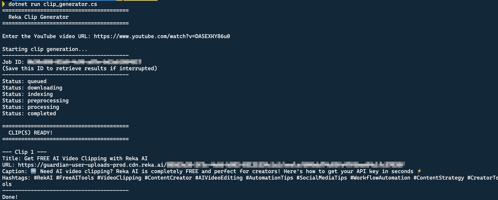
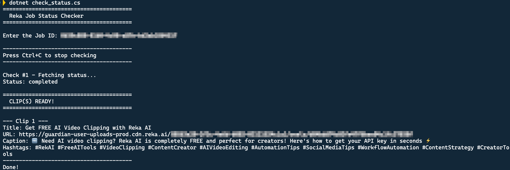

# C# Clip Tools

Simple C# file-based scripts to create video clips using the Reka AI API.

## Setup

1. Requires .NET 10 or later
2. Set your API key: `export REKA_API_KEY=your_key_here`

## Scripts

### clip_generator.cs

Creates a clip from a YouTube video.

```bash
dotnet run clip_generator.cs
```

Enter the video URL when prompted. The script streams progress and shows the Job ID (save it if interrupted).



### check_status.cs

Check the status of a clip job using its Job ID.

```bash
dotnet run check_status.cs
```

Enter the Job ID when prompted. Checks every 30 seconds until complete. Press `Ctrl+C` to stop.



## Links

- [Reka API Docs](https://docs.reka.ai/vision/highlight-reel-generation)
- [Reka Discord](https://link.reka.ai/discord)
