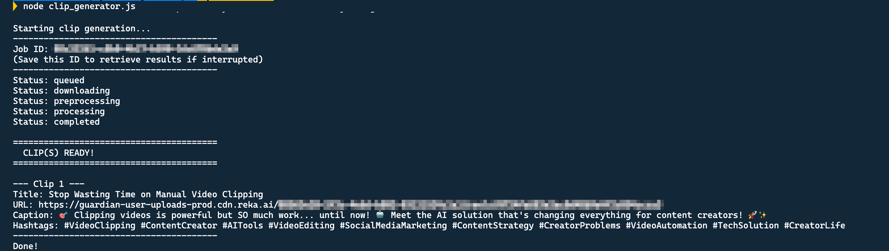
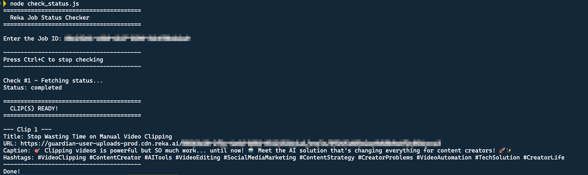

# Node.js Clip Tools

Simple Node.js scripts to create video clips using the Reka AI API.

## Setup

1. Requires Node.js 18 or later (uses native `fetch`)
2. Set your API key: `export REKA_API_KEY=your_key_here`

## Scripts

### clip_generator.js

Creates a clip from a YouTube video.

```bash
node clip_generator.js
```

Enter the video URL when prompted. The script streams progress and shows the Job ID (save it if interrupted).

**Sample Output:**



### check_status.js

Check the status of a clip job using its Job ID.

```bash
node check_status.js
```

Enter the Job ID when prompted. Checks every 30 seconds until complete. Press `Ctrl+C` to stop.

**Sample Output:**



## npm Scripts

You can also run the scripts using npm:

```bash
npm run clip    # Run clip_generator.js
npm run status  # Run check_status.js
```

## Links

- [Reka API Docs](https://docs.reka.ai/vision/highlight-reel-generation)
- [Reka Discord](https://link.reka.ai/discord)
