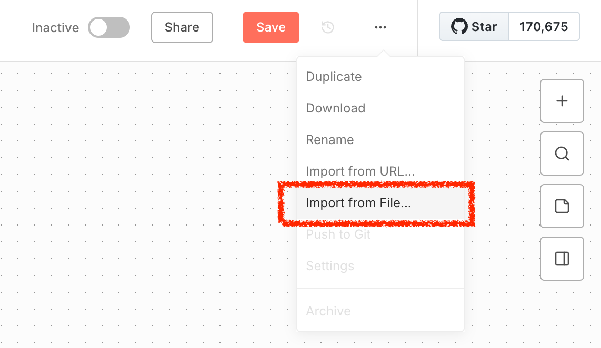
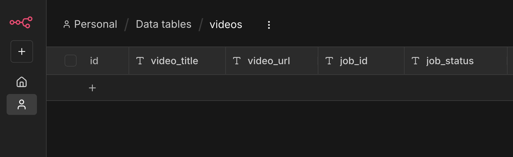
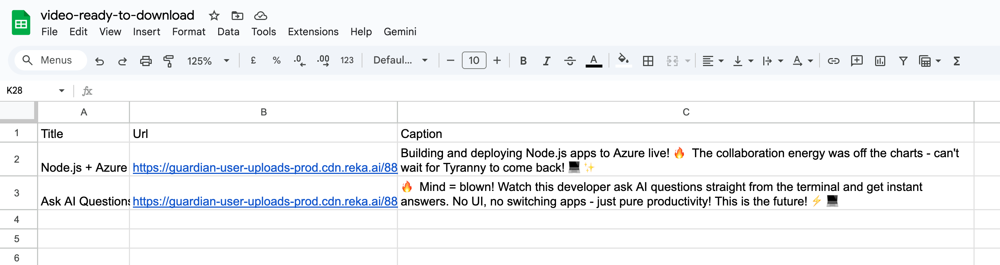
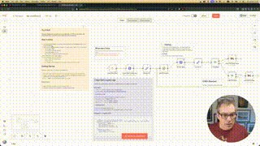

# n8n Workflows for Auto Clipping YouTube Videos

Each time there is a new video on a specific YouTube channel, create a short clip from it using AI. This repository contains two different approaches using **n8n** to automate the process of clipping YouTube videos using Reka Clips API.

## Example 1: Single Workflows - Looping

This is composed of a single **n8n** workflows that gets trigger by new video publish. It then creates a clipping job and wait until done. Once the clip is ready, it sends an email with all the clip info. It's compatible with n8n cloud and self-hosted instances. This template is also available directly from the [n8n community templates](link.reka.ai/n8n-template-api).


### Installation

1. Create a new workflow in n8n. From the top right corner, select the hamburger menu (three dots) > import from File and select the [auto-clip-with-http.json](n8n/auto-clip-with-http.json) file located in the `n8n` folder.

  

1. Follow the instructions in the workflows to configure the nodes
1. If you don't already have an API Key, get your free API key from [Reka Platform](https://link.reka.ai/free).

---

## Example 2: Dual Workflows - Async Processing

This template uses two separate workflows to handle the clip creation process asynchronously. The first workflow is triggered when a new video is published on a specific YouTube channel, creating a clip creation job. The second workflow periodically checks the status of the clip creation jobs and retrieves the clip URL once it's ready. It's a more scalable approach for n8n cloud users as it avoids long-running workflows. It's compatible with n8n cloud and self-hosted instances.

This is composed of 2 **n8n** workflows:

**Submit Reel Creation**: This workflow is triggered when a new video is published on a specific YouTube channel. It sends the video URL to Reka Clips API to create a short clip from the video.


**Check Reel Status**: This workflow checks the status of the clip creation process. Once the clip is ready, it retrieves the clip URL and shares it.


### Installation: Data Table, Workflows

- Create a Data table named `videos` with the following columns:
  - `video_title` (string)
  - `video_url` (string)
  - `job_id` (string)
  - `job_status` (string)

  

### Workflow: Submit Reel Creation

1. Create a new workflow in n8n. From the top right corner, select the hamburger menu (three dots) > import from File and select the [Submit Reel Creation.json](n8n/Submit%20Reel%20Creation.json) file located in the `n8n` folder.
1. When New Video (trigger):
   - Change the `YouTube channel ID` of the Feed URL for the channel you want to monitor.
1. Create Reel Creation Job:
   - If you don't already have an API Key, get your free API key from [Reka Platform](https://link.reka.ai/free).
   - Add your `API Key` to the field **Bearer Token** in the Bearer Auth.
   - If needed, update the JSON parameters to customize the clip creation. By default it looks like this:

   ```json
    {
        "video_urls": ["{{ $json.link }}"],
        "prompt": "Create an engaging short video highlighting the best moments",
        "generation_config": {
            "template": "moments",
            "num_generations": 1,
            "min_duration_seconds": 0,
            "max_duration_seconds": 30
        },
        "rendering_config": {
            "subtitles": true,
            "aspect_ratio": "9:16"
        }
    }
   ```

   This will create one short vertical clip (9:16) up to 30 seconds long, with subtitles, using the "moments" template.

1. Insert row:
   - Make sure there is no error.

After saving the workflow, activate it to start monitoring the YouTube channel for new videos.

### Flow: Check Reel status

1. Create a new workflow in n8n. From the top right corner, select the hamburger menu (three dots) > import from File and select the [Check Reel status.json](n8n/Check%20Reel%20status.json) file located in the `n8n` folder.
1. Trigger:
   - By default the trigger is manual, I prefer this when testing. Once you are happy with your setup, change it to a time trigger to run periodically (e.g., every 15-30 minutes). Checking too frequently may lead to hitting rate limits.
1. Get Job Status:
   - Same as before, add your `API Key` to the field **Bearer Token** in the Bearer Auth.
1. Append row in sheet:
   - Here I'm using Google Sheets to log the results, but you can use any other method to store or share the clip URL. (email, Slack, etc.) To use Google Sheets, make sure to set up the Google Sheets credentials in n8n.
   - Update the `Document`, `Sheet` and `Columns` fields to match your Google Sheets setup.
   

## Questions or issues

If you have any questions or run into issues, feel free to open an issue. You can also join the [Reka Community Discord](https://link.reka.ai/discord) for support and discussions.

---

## Documentation & Resources

- Documentation for Reka Clips API can be found here: [Clip Generation API (Reka Clip)](https://docs.reka.ai/vision/highlight-reel-generation)
- Blog post: [Automatically Create AI Clips with This n8n Template](https://dev.to/reka/automatically-create-ai-clips-with-this-n8n-template-6c1)
- Video Tutorial [YouTube](https://www.youtube.com/watch?v=DASEXKY86u0)

  [](https://www.youtube.com/watch?v=DASEXKY86u0)

## License

This project is licensed under the MIT License. See the [LICENSE](LICENSE) file for details.
